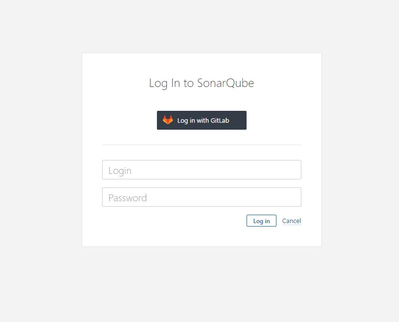
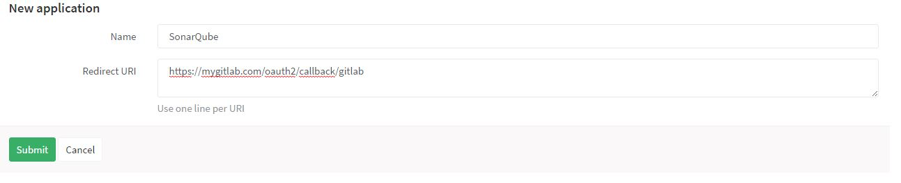
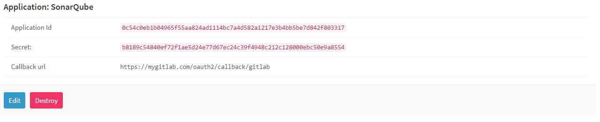
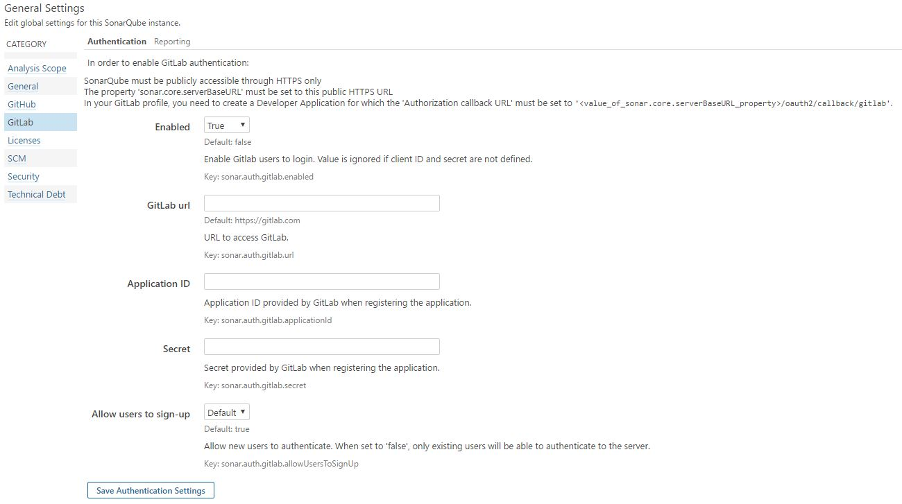

Sonar Auth GitLab Plugin
==============================

Forked from https://github.com/SonarSource/sonar-auth-github

# Goal

Enables user authentication and Single Sign-On via GitLab.

Uses GitLab OAuth login in SonarQube login page.

# Usage

For SonarQube >=5.6:

- Download last version https://github.com/gabrie-allaigre/sonar-auth-gitlab-plugin/releases/download/1.2.0/sonar-auth-gitlab-plugin-1.2.0.jar
- Copy file in extensions directory `SONARQUBE_HOME/extensions/plugins`
- Restart SonarQube 

For SonarQube >=5.4:

- Download last version https://github.com/gabrie-allaigre/sonar-auth-gitlab-plugin/releases/download/1.0.0/sonar-auth-gitlab-plugin-1.0.0.jar
- Copy file in extensions directory `SONARQUBE_HOME/extensions/plugins`
- Restart SonarQube 

**Other Plugin: [Add Reporting in GitLab commit](https://github.com/gabrie-allaigre/sonar-gitlab-plugin)**

# Configuration

- In GitLab, create Application OAuth : Admin Settings -> **Application**

Fill name SonarQube and fill redirect URI with 'https://mygitlab.com/oauth2/callback/gitlab' (replace url).

Copy Application Id and Secret in Settings of Sonarqube.

- In SonarQube: Administration -> General Settings -> GitLab -> **Authentication**

| Variable | Comment | Type |
| -------- | ----------- | ---- |
| sonar.auth.gitlab.enabled | Enable GitLab users to login. Value is ignored if client ID and secret are not defined |
| sonar.auth.gitlab.url | URL to access GitLab | 
| sonar.auth.gitlab.applicationId | Application ID provided by GitLab when registering the application |
| sonar.auth.gitlab.secret | Token of the user who can make reports on the project, either global or per project |
| sonar.auth.gitlab.allowUsersToSignUp | Allow new users to authenticate. When set to 'false', only existing users will be able to authenticate to the server |

# Sonarqube

https://sonarqube.com/dashboard?id=com.talanlabs%3Asonar-auth-gitlab-plugin